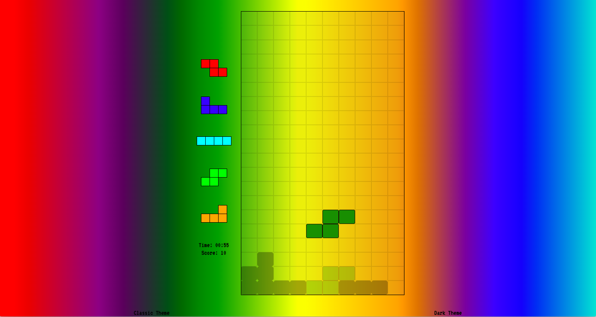

# General Assembly SEI Project 1: Tetris

## Introduction
The goal was to recreate the classic arcade game of Tetris using vanilla JavaScript.

This was Project 1 for the Software Engineering Immersive course at General Assembly.

## Technologies Used
- HTML5
- CSS3
- JavaScript
- Git
- GitHub

## Timeframe
1 Week (May 2019)

## Deployment
The project is currently deployed at http://shaneshibu.com/sei-project-1/

## Overview

The Tetris game requires players to strategically rotate, move, and drop a procession of Tetriminos that fall into the rectangular Matrix at increasing speeds. Players attempt to clear as many lines as possible by completing horizontal rows of blocks without empty space, but if the Tetriminos surpass the Skyline the game is over!

## Controls

- Move the falling tetrimino: ← → ↓ keys
- Rotate: ↑ key

## Wins
One of the biggest wins for me during this project was my solution for rotating tetriminos without repeating my code where I could avoid it. By creating a single Tetrimino Class and storing the rotation logic inside the class, rotating a tetrimino only required one function (Tetrimino.rotate()) regardless of which of the 7 shapes was currently active.

## Challenges
One of the biggest challenges was clearing rows when they were completed. Not only did the game have to check if each row had been filled, but after clearing each filled row the game had to move all the squares above those rows down by one. Having multiple timers running to check for filled rows and to drop the tetrimino proved to be tricky.

I faced another challenge when implementing a 2 player mode. This would mean there would be 2 grids side by side on the screen, and 2 players could use different keys on the same keyboard to play at the same time. Each time a player cleared a row on their grid, that row would be permanently added to their opponents grid. While I did manage to get this working there were bugs. By doubling the players, I was also doubling the number of JavaScript timers running in the background. This made the game start to lag. And while players could use the same keyboard, the keyboard couldn't accept input from 2 keys simultaneously, which caused problems if one player held a key down.

## Future Features
One oversight I didn't have time to correct was making the game playable on mobile devices. While I did use a mobile first design approach, the only player input I included was via a keyboard. To make the game playable on mobile devices, I would add on screen controls, so users could play via touchscreen. 
